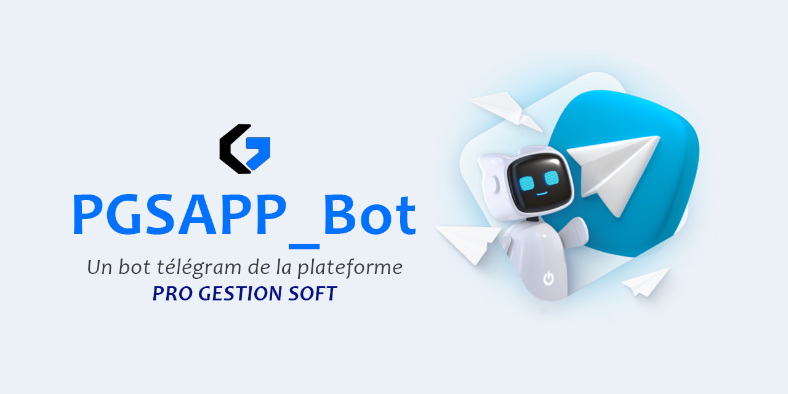

Les petites et moyennes entreprises (PME) sont le cœur économique de nombreux pays, y compris en Afrique. Elles représentent une grande partie de l'innovation, de l'emploi et de la croissance. Cependant, ces entreprises rencontrent souvent des défis importants en matière de gestion quotidienne, notamment la gestion des ressources humaines, des finances, des documents et des processus de recrutement. C'est là qu'une solution de gestion intégrée devient cruciale.

Dans cet article, nous allons explorer les avantages d'un système de gestion intégré pour les PME et comment **PRO GESTION SOFT** peut transformer la gestion de votre entreprise.

{/* truncate */}

# Qu'est-ce qu'une gestion intégrée ?
Une gestion intégrée fait référence à l'utilisation d'une plateforme unique pour centraliser et automatiser tous les processus de gestion d'une entreprise. Au lieu d'utiliser plusieurs outils déconnectés, une solution intégrée permet aux entreprises de gérer efficacement tous les aspects de leur activité à partir d'un seul endroit. Cela comprend la gestion des courriels, des ressources humaines, des documents, des recrutements et des facturations.

# Les avantages d'une gestion intégrée pour les PME
1. **Amélioration de l'efficacité opérationnelle** : La gestion des différentes fonctions de l'entreprise à partir d'une seule plateforme permet de réduire les tâches redondantes, d'optimiser les processus internes et de gagner du temps. Les employés peuvent se concentrer sur leurs tâches essentielles sans se soucier de la gestion de multiples outils.
2. **Accès centralisé aux informations** : Une solution intégrée comme PRO GESTION SOFT centralise toutes les données de l'entreprise, des informations sur les employés aux documents importants. Cela simplifie l'accès aux informations et réduit le risque de perdre des documents essentiels.
3. **Réduction des erreurs humaines** : L'automatisation des tâches et l'intégration des processus réduisent les risques d'erreurs humaines. Par exemple, la gestion de la paie, des absences ou des factures est automatisée, ce qui garantit une précision accrue.
4. **Meilleure prise de décision** : Grâce à un accès rapide et précis aux données de l'entreprise, les dirigeants peuvent prendre des décisions plus éclairées. Ils peuvent avoir une vue d'ensemble de la performance de l'entreprise et identifier rapidement les domaines nécessitant des améliorations.
5. **Sécurisation des données** : La centralisation des informations au sein d'une plateforme permet de mieux protéger les données de l'entreprise. Les solutions intégrées offrent généralement des fonctionnalités de sécurité avancées, telles que des sauvegardes automatiques et des protocoles de cryptage.

# Comment PRO GESTION SOFT peut aider votre PME ?
**PRO GESTION SOFT** est une plateforme de gestion intégrée spécialement conçue pour les PME béninoises et africaines. Elle vous permet de gérer :

- **Les courriels de l'entreprise** : Gestion centralisée des e-mails entrants et sortants, traitement et instructions entre les équipes.
- **Les ressources humaines** : Gestion de la paie, des contrats, de la formation, de la présence et des absences.
- **Les documents de l'entreprise** : Bibliothèque cloud sécurisée pour centraliser et sauvegarder tous les documents importants.
- **Le recrutement** : Publication des offres d'emploi, tests en ligne et gestion du recrutement à distance.
Les facturations : Suivi des ventes et des achats de manière simple et efficace.

Pour les PME, l'intégration des différents processus de gestion dans une plateforme unique n'est plus un luxe, mais une nécessité. Cela permet non seulement de gagner du temps et d'améliorer l'efficacité, mais aussi de se concentrer sur ce qui compte vraiment : faire croître l'entreprise. Avec **PRO GESTION SOFT**, vous disposez d'une solution clé en main pour transformer la gestion de votre entreprise et relever les défis modernes.

Prêt à découvrir comment PRO GESTION SOFT peut aider votre entreprise à atteindre de nouveaux sommets ? Contactez-nous dès aujourd'hui pour en savoir plus.

> Cet article a été généré avec l'aide de l'intelligence artificielle pour apporter une perspective innovante et enrichir notre contenu. Nous nous engageons à fournir des informations pertinentes et de qualité pour aider les PME à réussir dans un environnement numérique en constante évolution.

